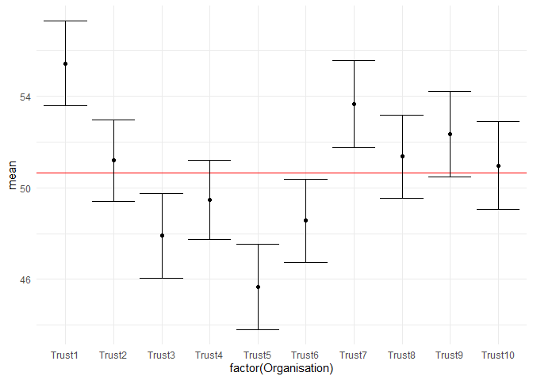

<!-- README.md is generated from README.Rmd. Please edit that file -->

# brilliant

<!-- badges: start -->

[](https://github.com/chrismainey/brilliant/actions)
<!-- badges: end -->

The goal of brilliant is to demonstrate some steps for building R
packages

## Installation

## Example

This is a basic example which shows you how to solve a common problem:

``` r
library(brilliant)
## 50 random values with mean = 50 and sd = 5

values <- rnorm(50, 50, 5)
mean <- mean(values)
sd <- sd(values)
n <- length(values)
se <- sd / sqrt(n)
ci_lower <- my_CI_lower(values, 5)
ci_upper <- my_CI_upper(values, 5)

my_dt<-data.frame(id=seq(50),values, ci_upper, ci_lower)

library(ggplot2)

ggplot(my_dt, aes(y=values, x=id))+
  geom_point()+
  geom_hline(aes(yintercept=mean), col="red", linetype="dashed")+
  geom_errorbar(aes(ymin=ci_lower, ymax=ci_upper))
```


